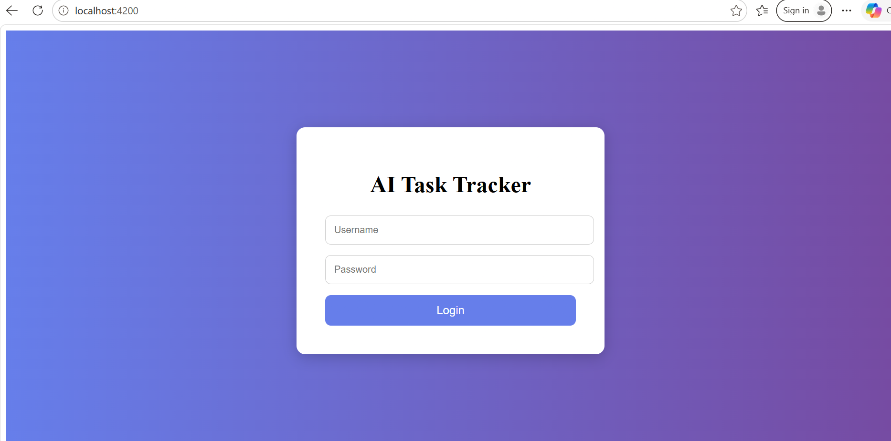
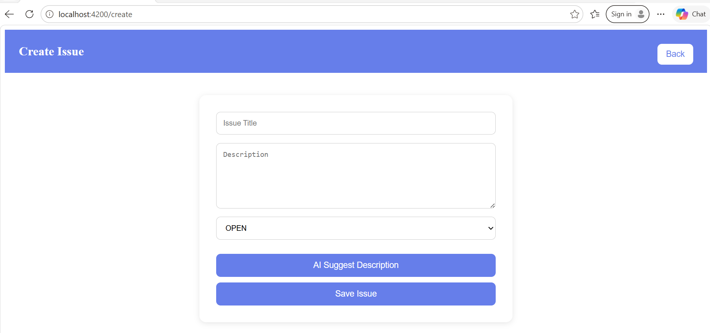
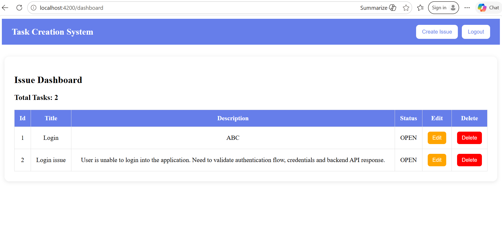
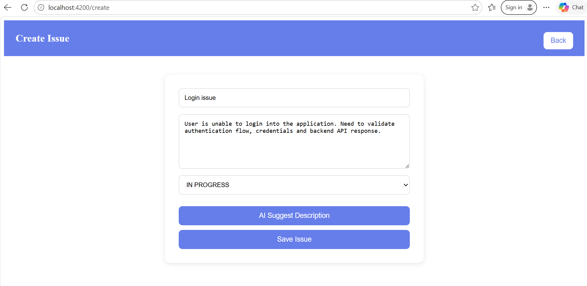

# AI Task tracker
- An AI-powered task management application built using Spring boot and Angular

# Feaures
- Task creation and management.
- AI-based description predicitions.
- JWT authentication
- Rest APIs.

# Tech Stack
- Java
- Spring Boot
- Angular
- MySQL
- Weka

# Tools
- IntelliJ IDEA
- Git
- Postman

# Future Enhancements
- Email notifications
- Dashboard analytics
- Task reminders

# Screenshots
- 
- 
- 
- 
